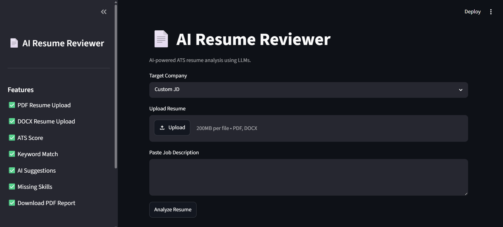
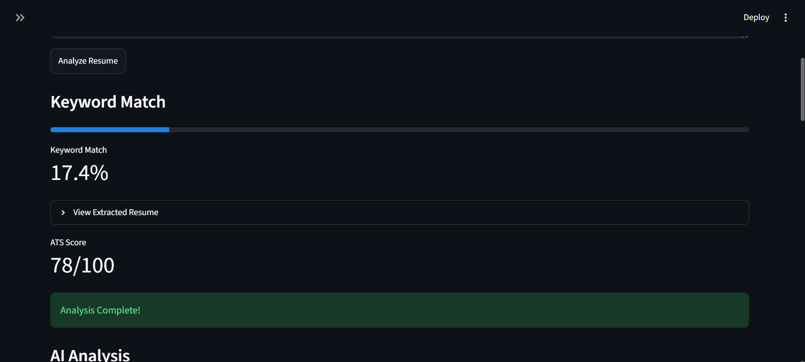
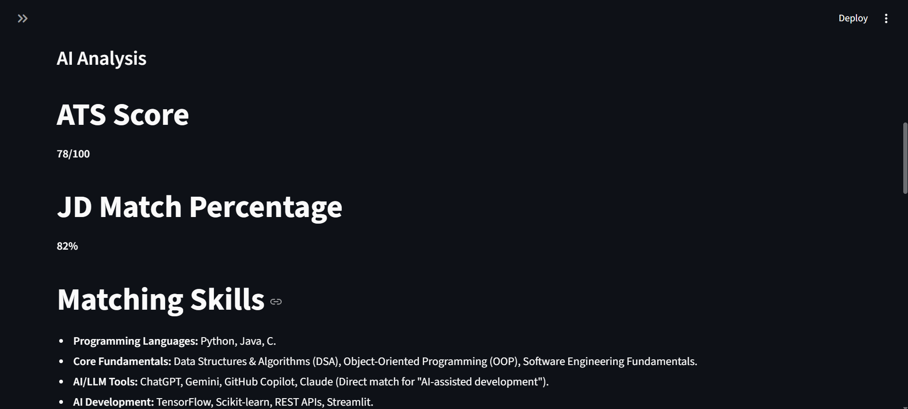
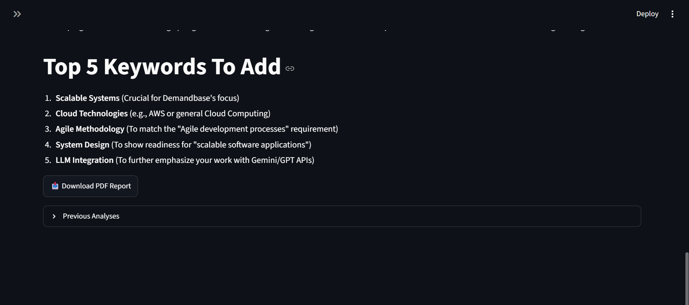

````markdown
# AI Resume Reviewer

An AI-powered ATS Resume Analysis tool built using Python, Streamlit, and LLM APIs.

## Features

- Upload PDF or DOCX resumes
- Compare resumes against Job Descriptions
- ATS Score generation
- Resume ↔ JD keyword matching
- Skill gap analysis
- Resume improvement suggestions
- Downloadable PDF analysis report

## Tech Stack

- Python
- Streamlit
- OpenRouter API
- pdfplumber
- python-docx
- ReportLab
- python-dotenv

## Installation

```bash
pip install -r requirements.txt
python -m streamlit run app.py
````

## Screenshots

### Home Page



### Resume Analysis







## Future Improvements

* Multi-resume comparison
* Resume keyword highlighting
* Database-backed analysis history

```
```
